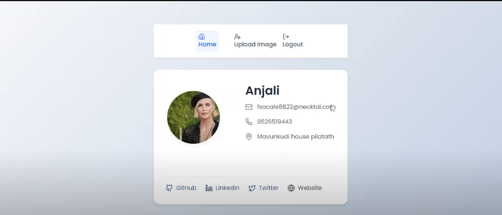

# User Management System

A simple User Management System where users can upload their profile images, and admins have the ability to update, delete, and edit user details.

## Features

- **User**: 
  - Upload a profile image.
  - View and update their own profile information.
  
- **Admin**: 
  - View, update, and delete user profiles.
  - Edit user details such as name, email, and other information.

## Technologies Used

- Frontend: [React](https://reactjs.org/) (or mention any other framework you are using)
- Backend: [Node.js](https://nodejs.org/) with [Express](https://expressjs.com/) (or your choice of backend framework)
- Database: [MongoDB](https://www.mongodb.com/) (or another database you're using)
- Authentication: [JWT](https://jwt.io/) (if using JWT for authentication)
- File Upload: [Multer](https://www.npmjs.com/package/multer) (if using Multer for image uploads)

## Installation

1. Clone the repository:
   ```bash
   git clone https://github.com/your-username/your-project-name.git
